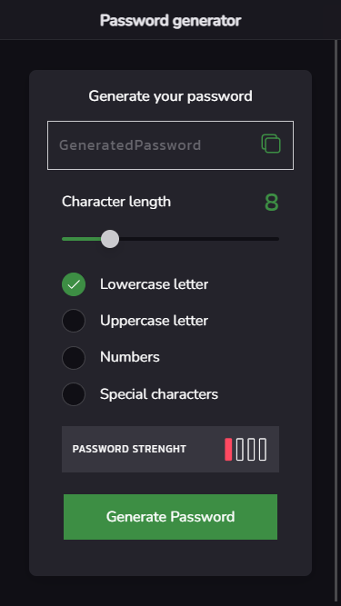
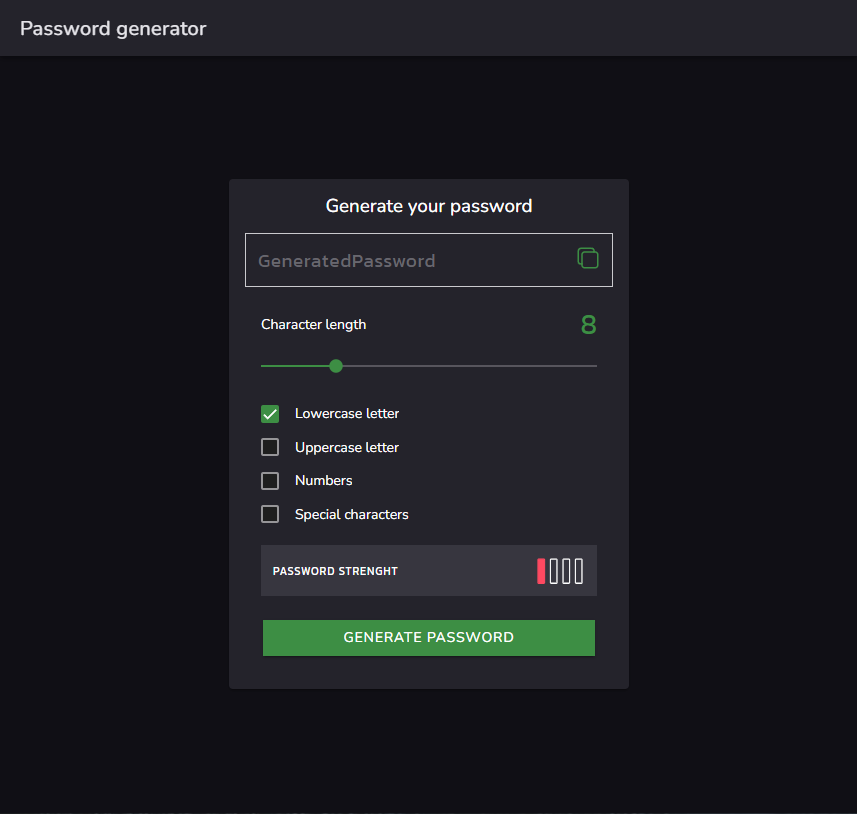
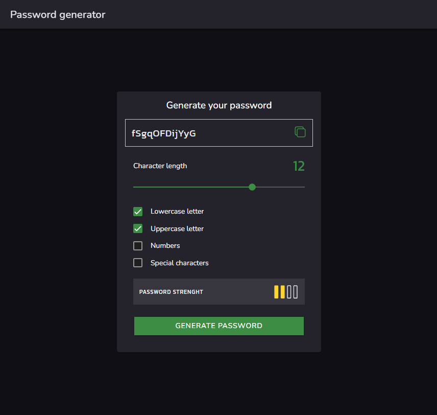
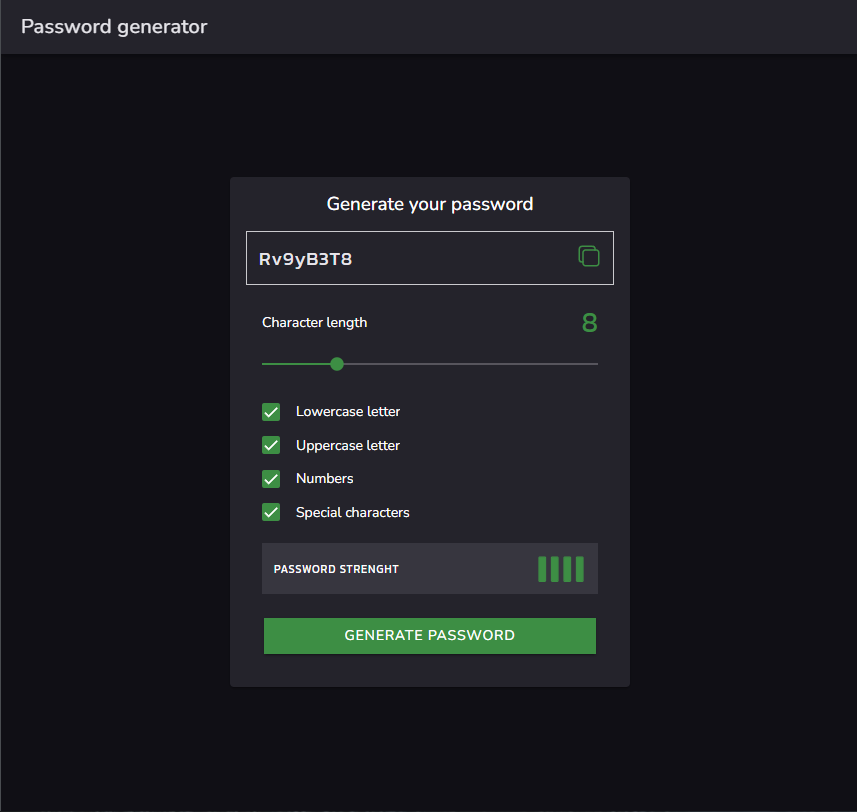

# Password generator
Project developed using Ionic and Angular inspired by one of the Challenges from **Frontend Mentors**.
This project is fully functional and was developed with the purpose of studying Ionic.

## Images

## How to run:

To run this application make sure you have angular and ionic in your computer.
Run the following command

`ionic serve`
